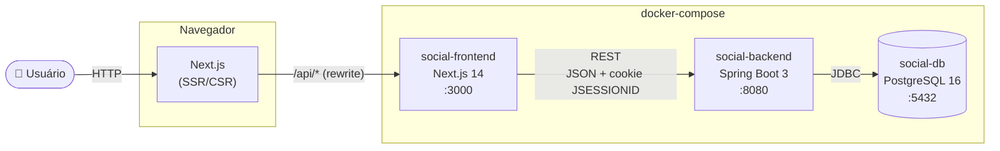
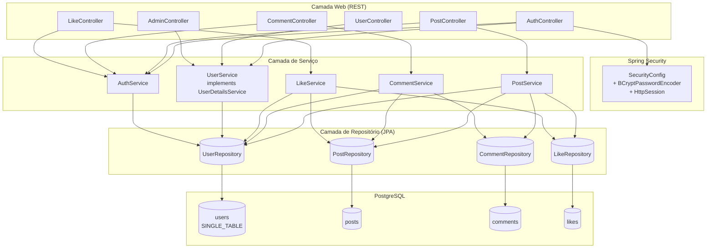
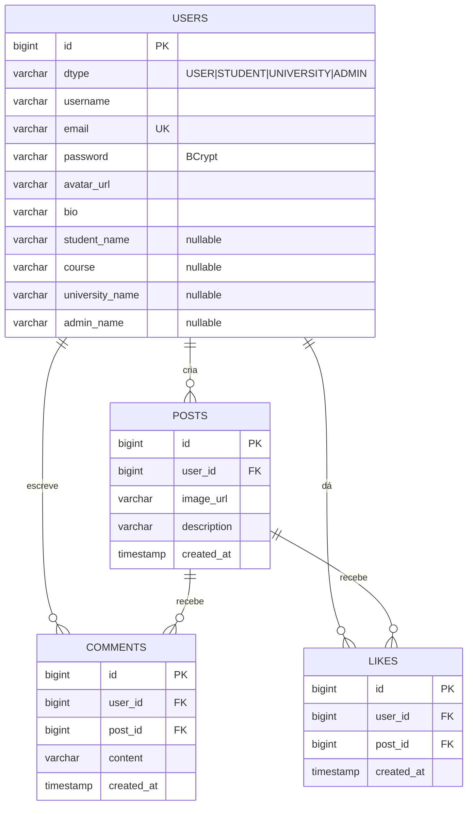
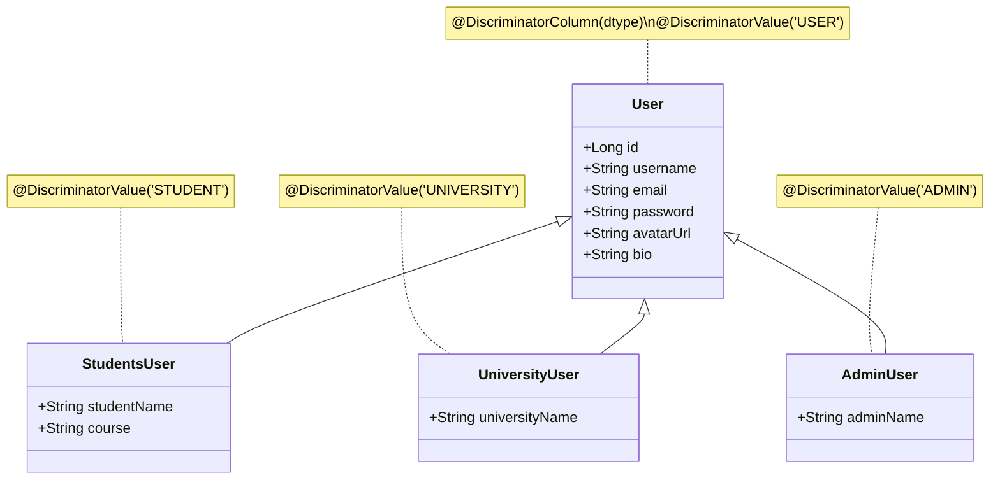
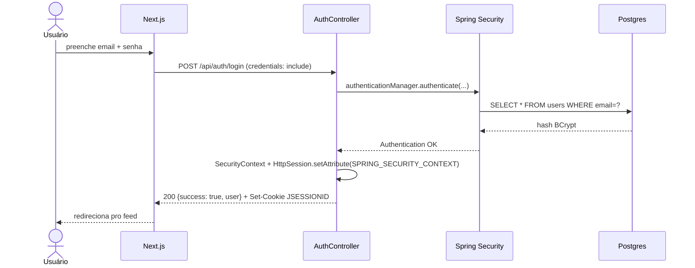
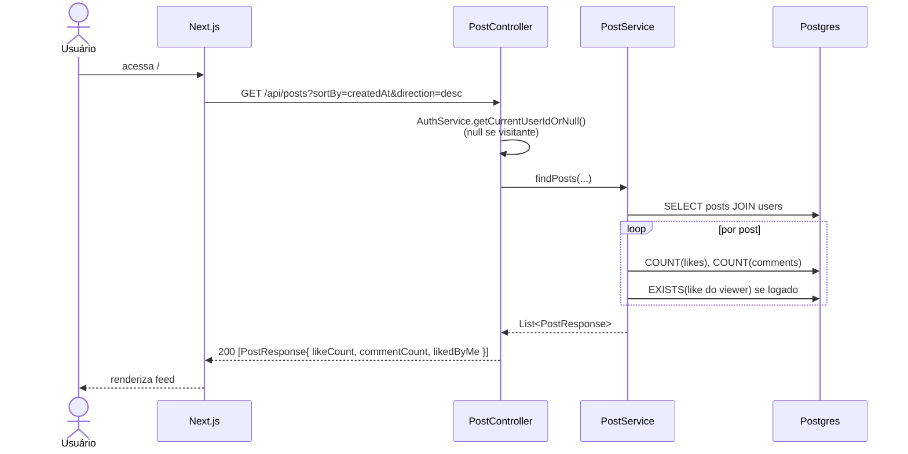
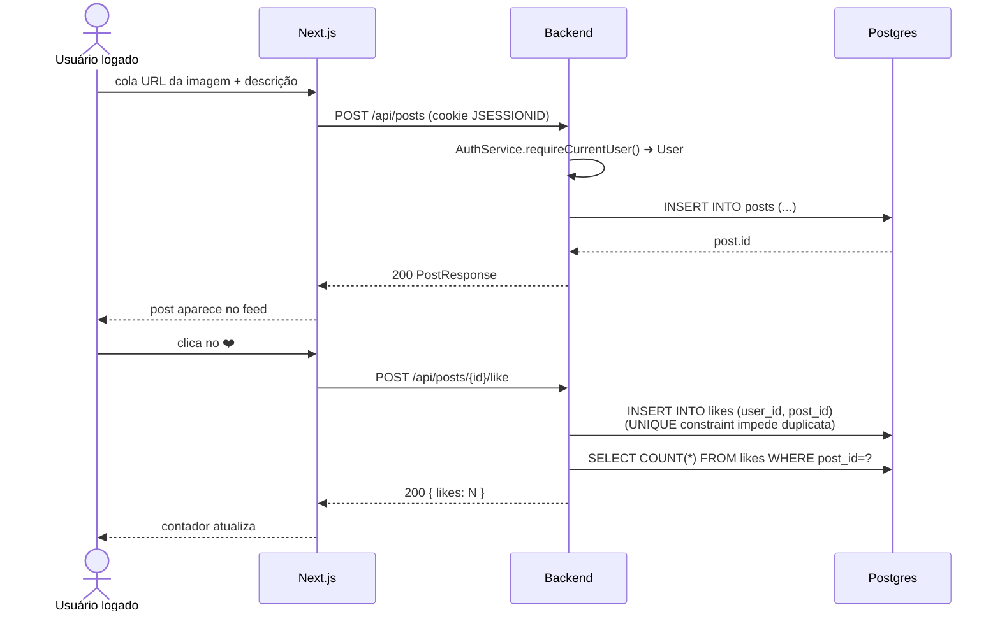
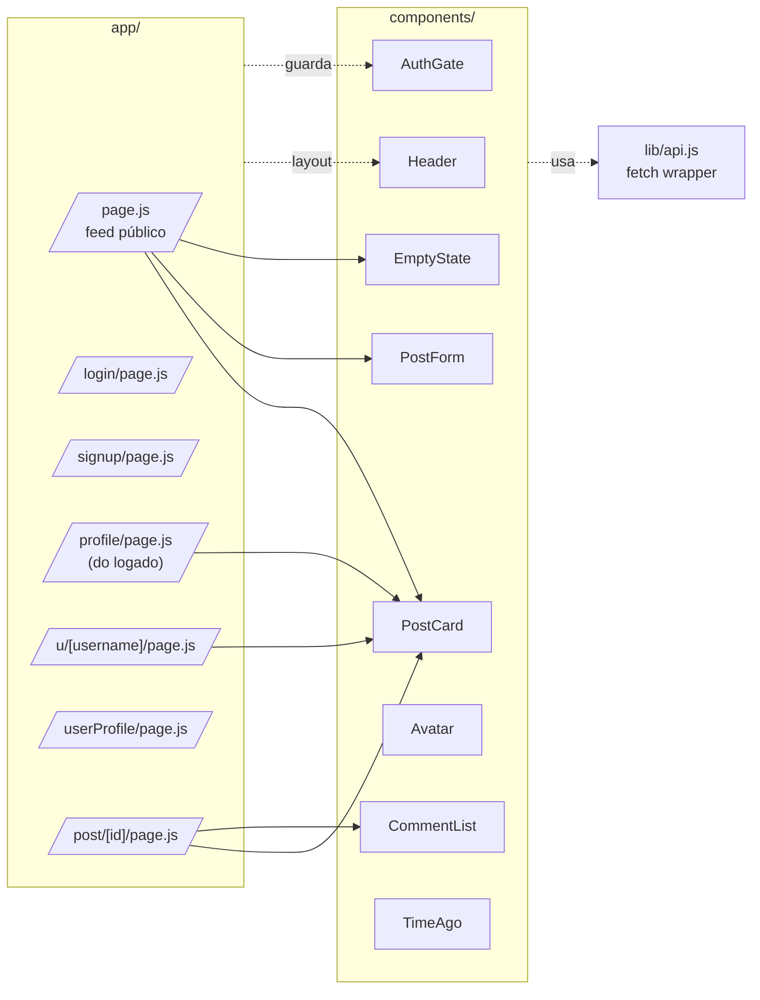

# 🏛️ Arquitetura — Social App

> Visão técnica do sistema: stack, camadas, fluxos e modelo de dados.
> Diagramas em [Mermaid](https://mermaid.js.org/) — renderizam direto no GitHub.

---

## 1. Visão geral

Aplicação web no formato de feed social acadêmico, dividida em três contêineres orquestrados via `docker-compose`:



| Camada | Tecnologia | Responsabilidade |
|---|---|---|
| Frontend | Next.js 14 (App Router) + Tailwind | UI, rotas, chamadas REST com `credentials: 'include'` |
| Backend | Spring Boot 3 + Spring Security + JPA | API REST, autenticação por sessão, regras de negócio |
| Banco | PostgreSQL 16 | Persistência relacional |
| Orquestração | Docker Compose | Build e subida local dos três serviços |

---

## 2. Arquitetura interna do backend

Padrão de camadas clássico Spring (Controller → Service → Repository → Entity):



**Pontos-chave:**

- **Autenticação por sessão** (`HttpSession` + cookie `JSESSIONID`), não JWT. O frontend envia `credentials: 'include'` em todas as chamadas.
- **BCrypt** para hash de senha ([SecurityConfig.java:71-73](backend/src/main/java/com/example/social/config/SecurityConfig.java#L71-L73)).
- **CORS** liberado para `http://localhost:3000` com `allowCredentials = true`.
- **CSRF desabilitado** — adequado pra dev, deve ser revisto antes de produção.

---

## 3. Modelo de dados

### 3.1 Diagrama Entidade-Relacionamento



> A tabela `likes` tem `UNIQUE(user_id, post_id)` — um usuário só curte um post uma vez.

### 3.2 Herança de usuários (SINGLE_TABLE)

A entidade `User` usa `@Inheritance(SINGLE_TABLE)` com discriminador `dtype`. Todos os perfis compartilham a mesma tabela `users`:



A migração [schema.sql](backend/src/main/resources/schema.sql) garante idempotência ao adicionar as colunas das subclasses em bancos pré-existentes.

---

## 4. Fluxos principais

### 4.1 Login



### 4.2 Listar feed (visitante e logado)



> O endpoint `GET /api/posts` é **público** ([SecurityConfig.java:47](backend/src/main/java/com/example/social/config/SecurityConfig.java#L47)) — quando logado, vem com `likedByMe` populado; visitante recebe `false`.

### 4.3 Criar post + dar like



---

## 5. Frontend (Next.js App Router)



- **`lib/api.js`** centraliza o `fetch` com `credentials: 'include'` para enviar o cookie de sessão.
- **`AuthGate`** protege rotas no client-side; a API ainda valida a sessão no backend.
- A base da URL é sempre `/api` (relativa) — em dev o Next faz proxy pro `localhost:8080`; em Docker, pro hostname `backend`.

---

## 6. Segurança — estado atual

| Item | Implementado | Observação |
|---|---|---|
| Senha em hash BCrypt | ✅ | [SecurityConfig.java:71](backend/src/main/java/com/example/social/config/SecurityConfig.java#L71) |
| Sessão via cookie HttpOnly | ✅ | Padrão do Spring Security |
| CORS restrito a localhost:3000 | ✅ | [SecurityConfig.java:61](backend/src/main/java/com/example/social/config/SecurityConfig.java#L61) |
| Rotas `/api/posts` e `/api/users/**` GET públicas | ✅ | Por design (feed visível pra visitante) |
| CSRF | ❌ desabilitado | Aceitável em dev; revisar antes de prod |
| `/admin` e `/admin/create` sem proteção | ⚠️ | [AdminController.java](backend/src/main/java/com/example/social/controller/AdminController.java) — atualmente fora do prefixo `/api`, sem `requireRole` |
| Verificação de e-mail institucional | ❌ | Previsto no backlog (EP-01) |
| Rate limiting / lockout | ❌ | Não implementado |

---

## 7. Subindo o projeto

```bash
docker compose up --build
```

| Serviço | URL |
|---|---|
| Frontend | http://localhost:3000 |
| Backend | http://localhost:8080/api/posts |
| Postgres | `localhost:5432` (db `socialdb`, user `admin`, senha `abc123`) |

Em dev local sem Docker, o backend espera Postgres em `localhost:5433` por padrão ([application.yml:3](backend/src/main/resources/application.yml#L3)).

### Seeds

- [schema.sql](backend/src/main/resources/schema.sql) — colunas do discriminador (idempotente).
- [data.sql](backend/src/main/resources/data.sql) — 8 usuários (senha `123`), 20 posts, 60 comentários, 90+ likes.

---

## 8. Referências cruzadas

- 📋 [Backlog](BACKLOG_SOCIAL_APP.md) — épicos, user stories e estimativas.
- 🌐 [API.md](API.md) — referência detalhada dos endpoints.
- 🐳 [docker-compose.yml](../docker-compose.yml) — orquestração.
